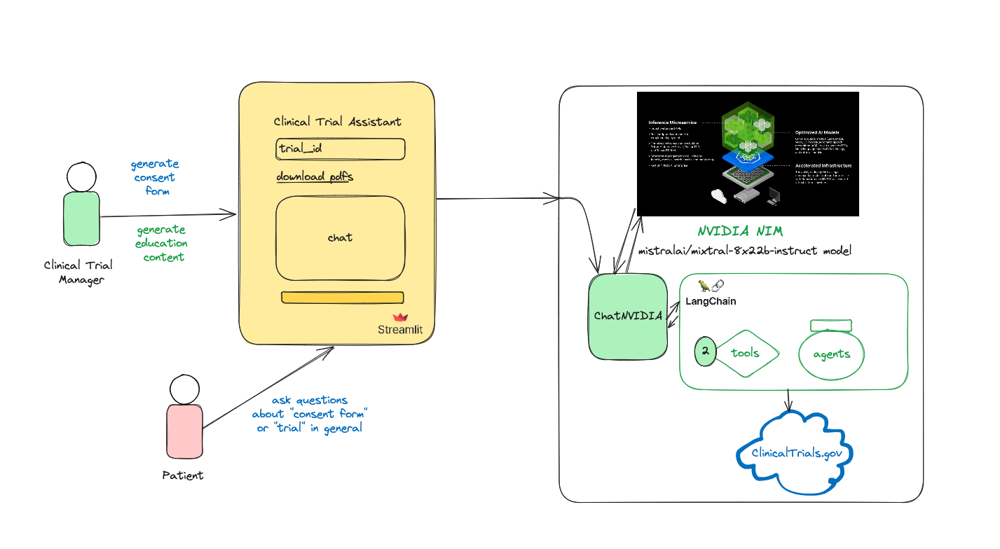

# NVIDIA-LangChain Challenge 2024




## Project Description

Our long-term vision is to improve diversity in clinical trials, ensuring that underrepresented groups are adequately included. This is crucial as current statistics show that 48% of clinical trials do not include a single Hispanic patient, and 43% lack African-American participants. This project leverages LLM via NVIDIA's NIM to enhance clinical trial processes, addressing key issues in recruitment, patient engagement, and diversity. Our application utilizes LLMs to automate the creation of informed consent documents and patient education materials, customizing them for specific trials. This ensures that participants receive clear, relevant information, fostering better understanding and participation. The LLM agent will also handle frequently asked questions about clinical trials in a conversational manner. By dispelling myths and promoting accurate knowledge about medical research, we aim to boost public understanding and trust in clinical trials. Clinical trials face significant recruitment challenges and issues with patient engagement. Ensuring diverse representation in these trials is critical for the generalizability and equity of medical research findings. Post-trial, LLMs can generate clear, concise summaries of clinical trial results, making the information more accessible to the public. Furthermore, Generative AI will create targeted educational materials about specific diseases and treatment options based on ongoing clinical trials. This initiative aims to educate diverse populations, ultimately improving recruitment and engagement in future clinical research.


## Sample Inputs

* Clinical Trial ID: ```NCT04195633``` (You can get more at https://clinicaltrials.gov)
* Sample user prompt: ```given my medical conditions, what should I be concern about with this trial?```
* Create .env file and add ```NVIDIA_API_KEY=YOUR_KEY```


## Developer Notes

python3 -m venv env
source env/bin/activate
deactivate

pip install -r requirements.txt

streamlit run simple-rag.py    